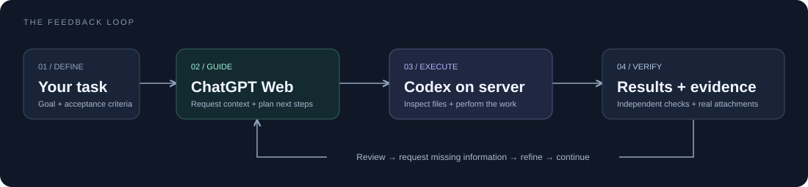

<p align="center">
  
</p>

<p align="center">
  <strong>自己指导，自己执行，持续改进。</strong><br>
  ChatGPT 主导 · Codex 执行 · 真实反馈驱动下一步
</p>

<p align="center">
  <a href="LICENSE"></a>
  <a href="https://github.com/JackBo04/selfguide/releases"></a>
  <a href="docs/server-browser.md"></a>
  <a href="docs/local-browser.md"></a>
</p>

<p align="center">
  <a href="#quickstart">快速开始</a> ·
  <a href="docs/agent-install.md">Agent 安装规范</a> ·
  <a href="https://github.com/JackBo04/selfguide/releases">下载安装包</a> ·
  <a href="docs/validation.md">验证记录</a> ·
  <a href="https://github.com/JackBo04/selfguide/issues">反馈问题</a>
</p>

---

## 让下一步，来自上一步的真实结果

**SelfGuide 把指导、执行和反馈组织成一个持续运行的协作循环。** 你给出目标和验收标准，网页版负责方案、信息需求和关键决策；Codex 从真实环境取证，执行步骤，独立验证，再把文件与结果交回网页评审。

缺少一份日志？网页版向 Codex 提出需求，Codex 读取并补充。实验结果与预期不符？上传实际证据，让网页版据此更新方案。整个过程围绕同一个任务持续推进，需要你提供独有信息或作出关键决定时再交给你。

| 网页主导 | 执行有据 | 过程可恢复 |
| :--- | :--- | :--- |
| 方案、追问、关键取舍和验收由网页版主导 | Codex 读取实际文件，提交真实附件和独立验证结果 | 每个任务保存会话地址、完整收发和发送状态 |
| 默认网页版 **xhigh**，难题按需选择 **Pro** | 工作始终在你选定连接的服务器上完成 | 中断后核对原会话和记录，避免盲目重复发送 |

## 自指导循环如何工作

<p align="center">
  
</p>

每个新任务都在配置的 ChatGPT 项目中新建专用会话（现有部署名为 **astra**）。方案、补充信息、执行问题和结果评审沿用这条会话，服务器同步保存任务档案。

**已有真实验证：** 合成 TXT 上传 → 网页读出附件独有随机码 → 指导生成 JSON → Codex 独立核对 → JSON 结果回传 → 网页验收通过。[查看验证范围 →](docs/validation.md)

> **当前状态 · Preview**
>
> 服务器方案已有真实 ChatGPT 闭环验证。本地浏览器版已通过真实 Chromium 扩展与模拟页面联调，仍需在用户电脑的真实 ChatGPT 页面完成首次验收；本地扩展目前不支持自动切换网页档位。

<a id="quickstart"></a>

## 快速开始：把安装交给 Agent

在**已经连接目标服务器的 Codex／Agent 会话**中，复制对应指令即可开始。Agent 会读取安装规范，完成可执行的配置，并说明需要你处理的步骤。

### ① 选择浏览器的位置

| | 服务器浏览器版 | 本地浏览器版 |
| :--- | :--- | :--- |
| **Codex 执行位置** | 你连接的服务器 | 你连接的服务器 |
| **ChatGPT 浏览器** | 服务器专用 Chrome，通过远程画面查看 | 自己电脑上的 Chrome／Edge |
| **连接方式** | 虚拟桌面与远程查看入口 | 浏览器扩展与 SSH 隧道 |
| **适合** | 复用当前服务器浏览器，让它持续运行 | 使用自己电脑的浏览器登录 |
| **调用名称** | `$chatgpt-supervised-server` | `$chatgpt-supervised-local` |
| **详细说明** | [服务器版安装指南](docs/server-browser.md) | [本地版安装指南](docs/local-browser.md) |

### ② 复制安装指令

**服务器浏览器版**

```text
请在当前连接的服务器上安装并配置：
https://github.com/JackBo04/selfguide

选择 server 版本，先读取 README.md 和 docs/agent-install.md，按规范执行。
复用已有 astra 项目、浏览器和登录状态，完成安装、配置及合成附件的真实验收。
普通步骤和可逆修复直接处理；只有缺少必要信息、需要我登录或决定时再问我。
最后给我安装位置、实际验证结果和后续任务调用示例。
```

**本地浏览器版**

```text
请在当前连接的服务器上安装并配置：
https://github.com/JackBo04/selfguide

选择 local 版本，先读取 README.md 和 docs/agent-install.md，按规范执行。
Codex 继续在服务器干活，ChatGPT 使用我电脑上的 Chrome／Edge。
先完成服务器配置，再一次性给我扩展下载入口、SSH 转发命令和配对步骤。
连接后用合成附件完成两轮真实验收。普通步骤直接处理，必要时再问我。
分别报告服务器安装、本地连接和真实验收的状态。
```

初次登录、人机验证，以及自己电脑上的扩展安装和配对，仍需你亲自完成。后续复用已有浏览器登录；网站要求重新验证时再处理。

<details>
<summary><strong>更喜欢终端？展开手动安装</strong></summary>

在服务器终端运行。公开仓库无需 GitHub 登录；需要 Git 和 Python 3.10+。

```bash
git clone https://github.com/JackBo04/selfguide.git
cd selfguide

# 二选一
python3 tools/install.py server
python3 tools/install.py local
```

也可从 [Releases](https://github.com/JackBo04/selfguide/releases) 下载对应 ZIP，解压后执行包内 `tools/install.py`。

SelfGuide 延续已有的 `$chatgpt-supervised-server` 和 `$chatgpt-supervised-local` 调用名；聊天项目 `astra`、任务目录与登录配置也沿用现有部署。安装器默认写入 `~/.agents/skills/`，不覆盖同名安装。以上命令完成 skill 安装，浏览器服务、项目、SSH 和扩展仍需按 [服务器指南](docs/server-browser.md) 或 [本地指南](docs/local-browser.md) 配置。安装后开启新的 Codex 会话，让它发现新增 skill。

</details>

### ③ 给出任务和完成标准

```text
使用 $chatgpt-supervised-server。

任务：分析这次实验失败的原因，并完成可验证的修复。
材料：<服务器上的代码、日志和结果路径>
验收标准：<预期行为、指标或必须通过的检查>

让 astra 网页版主导方案；缺失信息由你取证并补充。
按反馈持续执行，提交真实结果和验证证据，只有需要我决定时才问我。
```

本地浏览器版将第一行换成 `$chatgpt-supervised-local`。你可以直接给服务器文件路径，也可以将候选材料放进 `astra/inbox/` 再说明任务；Codex 按任务选择材料，放入文件本身不会触发上传。

## 明确分工，保留你的控制权

| 职责 | 负责什么 |
| :--- | :--- |
| **你** | 定义目标、约束与完成标准，处理独有信息和关键决定 |
| **网页版 ChatGPT** | 主导总体方案，提出信息需求，决定下一步并评审证据 |
| **Codex** | 读取环境与文件，按需求补充事实，执行、修复、独立验证和反馈 |

日常信息收集和可逆修复由 Codex 处理；关键路线与假设变化带着证据交回网页讨论。网页建议受原任务范围约束，Codex 仍需核对实际情况。

**档位策略：网页版默认 xhigh（Extra High），明显困难的推理问题按需选择网页版 Pro。** 这个判断由 Codex 处理，不修改 Codex 自身的模型或推理档位，也不代表升级订阅。服务器版通过可见网页控件操作；本地扩展尚无自动切档命令，需要本地用户或可用的本地操作工具配合。

[阅读完整分工、切档规则与交接模板 →](https://github.com/JackBo04/selfguide/blob/main/skills/chatgpt-supervised-server/references/leadership.md)

## 反馈直接交接原文

**网页版给出可一键复制的完整文本块，Codex 保存原文后执行。** 服务器版通过复制按钮获取，本地版直接读取网页文本；截图用于定位控件和确认状态。长代码、报告可另附文件，普通反馈无需每轮下载附件。

每轮自动附上任务号、轮次和首尾标记，接收时检查，原文与来源记录保存在 `feedback/` 和 `state.json`。遇到格式不符，先重取并核对；确需例外时留下核对说明，避免靠截图猜测或补全指令。本地扩展暂不支持下载文件自动回传服务器。

[查看文本交接与恢复规则 →](skills/chatgpt-supervised-server/references/text-handoff.md)

## 每一步，都留下可追溯的证据

```text
astra/
├── inbox/                    候选材料，按需建立
└── tasks/<任务 ID>/
    ├── task.txt              目标与验收要求
    ├── state.json            进度、轮次与网页会话地址
    ├── uploads/              选定附件副本与来源校验清单
    ├── messages/             发给网页版的说明
    ├── feedback/             网页版完整回复
    ├── outputs/              交付物
    └── checks/               独立验证与恢复证据
```

原研究文件留在原处。浏览器登录状态与任务材料分开保存，源码和发行包不包含账户凭据、真实聊天记录或研究数据。

<details>
<summary><strong>常见问题</strong></summary>

**服务器没有图形界面，可以用吗？**

服务器版使用 Xvfb 提供虚拟桌面；本地版的服务器桥接仅依赖 Python 标准库，浏览器运行在自己电脑上。完整依赖见对应安装指南。

**需要每次登录吗？**

默认复用已有登录。网站使会话失效或要求验证时需人工处理，不能保证永不重新登录。

**电脑可以休眠或关机吗？**

本地版需要电脑、浏览器与 SSH 隧道保持运行；断线后按任务记录恢复。服务器版的远程查看页面可以关闭，服务器 Chrome 继续运行。

**发送超时怎么办？**

检查原任务状态和网页，不直接重复提交。发送结果不明与发送失败是两种不同状态。

**支持大文件吗？**

本地桥接默认单文件最多 8 MiB，这是程序限制。大材料先提取相关样本、摘要或图表；实际上传仍以网页支持情况为准。

**会自动启动 Codex 吗？**

不会。你需要在运行中的 Codex 会话里给出任务；浏览器和桥接服务负责协助收发。

</details>

## 参与改进

欢迎通过 [Issues](https://github.com/JackBo04/selfguide/issues) 提交可复现的问题，或通过 Pull Request 改进实现。以下方向尤其有帮助：

- **页面适配：** 网页输入框、附件卡片、回复完成标记与档位控件。
- **本地版验证：** 不同系统的 Chrome／Edge、SSH 连接及真实账户联调。
- **恢复体验：** 断线、页面重载与发送结果不明时的可观测性。
- **文档与示例：** 更易复现的安装步骤和合成任务案例。

反馈问题时附版本、系统、浏览器、复现步骤和经过脱敏的错误信息。请勿提交登录资料、配对码或私人聊天内容。

<details>
<summary><strong>开发与验证命令</strong></summary>

在完整仓库源码目录运行。需要 Python 3.10+；Node.js 20+ 用于服务器桌面服务和浏览器测试，扩展本身无需编译。

```bash
python3 -m unittest discover -s tests -p 'test_*.py' -v
npm ci
npx playwright install chromium
node tests/test_extension.mjs
python3 tools/package.py
```

打包生成两个 ZIP 和 `dist/SHA256SUMS`，仅收集明确列出的源码和说明目录。扩展测试使用模拟页面，不代替真实账户验收。[完整验证记录 →](docs/validation.md)

</details>

## License

[MIT](LICENSE) © Huangbo Zou。允许使用、修改和分发，需保留许可证与版权声明；依赖软件遵循各自许可证。

<sub>参考：[OpenAI skill 文档](https://developers.openai.com/codex/skills) · [Chrome 扩展消息传递](https://developer.chrome.com/docs/extensions/develop/concepts/messaging) · [扩展网络请求](https://developer.chrome.com/docs/extensions/develop/concepts/network-requests)</sub>
